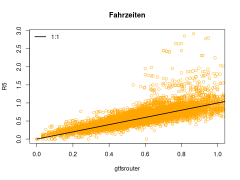

```{r xaringan, include = FALSE}
library(xaringanthemer)
source ("myxaringantheme.R")
```

```{r setup, include=FALSE}
options(htmltools.dir.version = FALSE)# suppress version num in subdir name

knitr::opts_chunk$set(cache = TRUE,
                      warning = FALSE)
                      #message = FALSE)
```

class: left, middle, inverse

<br><br><br><br>

.left-column[

`r icons::icon_style (icons::fontawesome("github"), scale = 1, fill = "white", rotate = "spin")` mpadge

`r icons::icon_style (icons::fontawesome("github"), scale = 1, fill = "white", rotate = "spin")` atfutures

`r icons::icon_style (icons::fontawesome("github"), scale = 1, fill = "white", rotate = "spin")` ropensci

]

.right-column[

`r icons::icon_style (icons::fontawesome("twitter"), scale = 1, fill = "white", rotate = "spin")` bikesRdata

`r icons::icon_style (icons::fontawesome ("envelope"), scale = 1, fill = "white")` .small[mark.padgham@email.com]

`r icons::icon_style (icons::fontawesome ("globe"), size = 5, fill = "white")` mpadge.github.io

]


---

class: left, top, inverse

# gtfsrouter

- Mark Padgham (@mpadge)
- Alexandra Kapp (@AlexandraKapp)
- Marcin Stepniak (@stmarcin)
- Flavio Poletti (@polettif)

Mit finanziellen Unterstützung von<br>Mobility Institute Berlin (MiB).


[https://github.com/atfutures/gtfs-router](github.com/atfutures/gtfs-router)

`r icons::icon_style (icons::fontawesome ("rocket"), fill = "white")` Suche "gtfsrouter"

---
class: left, top

# Grundproblem: menschliche Mobilität

- Wir müssen weg vom Auto, mehr zu Fuß, auf dem Fahrrad, und in öffentlichen
  Verkhersmitteln

- Wie? Wo? Wann? Warum?

- Die Notwendigkeit von Antworten stellt eine enorme kommerzielle Chance dar

- Beispeil mittels eine einfache Frage: *Fahrzeiten*
    - [traveltime.com](https://traveltime.com)
    - Etwa €400/Monat für eine Stadt, um zu wissen, wie lange es dauert

- Wo keine FOSSGIS Lösungen entstehen, haben Städte weniger Geld für
  Umwandlungsprogramme

---
class: left, top

# Grundproblem: menschliche Mobilität

- Beispeil mittels eine ~~einfache~~ Frage: *Fahrzeiten*

- Für jedes Stadtgebiet, wie lange brancht man mit dem Auto im Vergleich zu
  öffentlichen Verkehrsmitteln, um ins oder aus dem Stadtzentrum zu kommen?

--

- €400 / Monat / Stadt

- DE hat 191 Städte mit über 50.000 Einwohner

- Über €900.000 / Jahr für alle Städte (laufend!)

---

# FOSSGIS Lösungen

- [OpenTripPlanner (OTP)](http://www.opentripplanner.org/)
    - focussiert auf individuelle routing Probleme, und is nicht ohne
      weiteres auf stadtwiete Lösungen anwendbar

- [Conveyal R5 Routing Engine](https://github.com/conveyal/r5) (Rapid Realistic
  Routing on Real-world and Reimagined networks)
    - einfacher auf stadtwiete Lösungen anzuwenden, ist aber dennoch sehr
      entwickler-focussiert, und nicht für allgemeine Nutzung orientiert
    - Für eine Stadt wie Berlin, braucht mehrere Stunden

---

## ~~Das~~ gtfs~~router-Paket~~

- GTFS = General Transit Feed Specification

- Richtlinien für die Spezifikation von Fahrplandaten

- Viele Städte bieten ihre Fahrpläne als Offentlichedaten in GTFS-Form an

- Meta-Repositories von GTFS-Daten, z.B. [transit.land](https://transit.land)
  mit Daten von über 2.500 Städte, 55 Länder

---

## Das [gtfsrouter-Paket](https://atfutures.github.io/gtfs-router/)

- Verfügbar als Paket in der Computersprache **R**, mit Algorithmen in C++

- 2 Hauptfunktionen:
    1. A->B Routing (`gtfs_route()`)
    2. Fahrzeiten von A zu allen Haltestellen (`gtfs_traveltimes()`)

---

## GTFS Einlesung und Vorbereitung

- GTFS Daten müssen zuerst eingelesen werden (`extract_gtfs()`)

- Daten müssen normalerweise für die Anwendung auf einen bestimmten Zeitbereich
  umgerechnet werden (`gtfs_timetable()`).

---

## GTFS Einlesung und Vorbereitung

- Beispiel:

```{r extract, eval = FALSE, echo = FALSE}
library (gtfsrouter)
f = "vbb.zip" # Verkehrsverbund Berlin-Brandenburg
s = structure (file.size (f), class = "object_size")
format (s, units = "MB")
g = extract_gtfs (f) # 3-4 Sekunden
g = gtfs_timetable (g, day = "Wednesday")
names (g)
```
```{r extract-fakey, eval = FALSE, echo = TRUE}
library (gtfsrouter)
f = "vbb.zip" # Verkehrsverbund Berlin-Brandenburg
file.size (f)
#> [1] 49.4 Mb
g = extract_gtfs (f) # 3-4 Sekunden
g = gtfs_timetable (g, day = "Wednesday")
names (g)
#> [1] "agency"         "calendar"       "calendar_dates"
#> [4] "frequencies"    "pathways"       "routes"
#> [7] "shapes"         "stop_times"     "stops"
#> [10] "transfers"      "trips"          "timetable"
#> [13] "stop_ids"       "trip_ids"
```

---

## GTFS Einlesung und Vorbereitung


- GTFS Daten müssen zuerst eingelesen werden (`extract_gtfs()`)

- Daten müssen normalerweise für die Anwendung auf einen bestimmten Zeitbereich
  umgerechnet werden (`gtfs_timetable()`).

```{r extract-clean, eval = FALSE, echo = TRUE}
library (gtfsrouter)
g = extract_gtfs ("vbb.zip") # 3-4 Sekunden
g = gtfs_timetable (g, day = "Wednesday")
```

---

## GTFS Fahrzeiten

```{r traveltimes0, eval = FALSE, echo = TRUE}
library (gtfsrouter)
g = extract_gtfs ("vbb.zip") # 3-4 Sekunden
g = gtfs_timetable (g, day = "Wednesday")
```

---

## GTFS Fahrzeiten

```{r traveltimes1, eval = FALSE, echo = TRUE}
library (gtfsrouter)
g = extract_gtfs ("vbb.zip") # 3-4 Sekunden
g = gtfs_timetable (g, day = "Wednesday")

abfahrt_ort = "Alexanderplatz"
abfahrt_zeiten = c (9, 10) * 3600 # 09:00 - 10:00 in Sek.
```

---

## GTFS Fahrzeiten

```{r traveltimes2, eval = FALSE, echo = TRUE}
library (gtfsrouter)
g = extract_gtfs ("vbb.zip") # 3-4 Sekunden
g = gtfs_timetable (g, day = "Wednesday")

abfahrt_ort = "Alexanderplatz"
abfahrt_zeiten = c (9, 10) * 3600 # 09:00 - 10:00 in Sek.

x = gtfs_traveltimes (g, #<<
                      from = abfahrt_ort, #<<
                      start_time_limits = abfahrt_zeiten) #<<
```

--

- Berechnung dauert etwa 0.2-0.3 Sek.
- Fahrzeiten zu etwa 10.000 Haltestellen


---

## GTFS Fahrzeiten

```{r traveltimes-str, eval = FALSE}
x = gtfs_traveltimes (g,
                      from = abfahrt_ort,
                      start_time_limits = abfahrt_zeiten)
head (x) # Zeigt die erste paar Zeilen an
```
```{r traveltimes-str-out, eval = TRUE, echo = FALSE}
st = hms::as_hms (c ("09:08:12", "09:03:00", "09:03:00",
                      "09:22:30", "09:08:12", "09:08:12"))
dur = hms::as_hms (c ("00:47:48", "00:33:00", "00:45:00",
                       "00:57:30", "00:57:48", "00:53:48"))
ntr = c (2, 0, 0, 1, 2, 2)
stop_id = c ("000008012713", "000008012666", "000008010279",
              "000008011188", "000008012096", "000008011334")
stop_nm = c ("Rangsdorf, Bahnhof", "S Potsdam Hauptbahnhof",
              "Potsdam, Pirschheide Bhf", "Biesenthal, Bahnhof",
              "Kremmen, Bahnhof", "Dabendorf, Bahnhof")
lon = c (13.43111, 13.06719, 13.01084, 13.67448, 13.03968, 13.43744)
lat = c ( 52.29413, 52.39093, 52.37391, 52.75571, 52.75340, 52.23726)
data.frame (start_time = st,
            duration = dur,
            ntransfers = ntr,
            stop_id = stop_id)
data.frame (stop_name = stop_nm,
            stop_lon = lon,
            stop_lat = lat)
```


---

## GTFS Fahrzeiten: Visualization

```{r mapdeck, eval = FALSE}
x$Stunden = as.integer (x$duration) / 3600
library (mapdeck)
mapdeck (style = mapdeck_style ("dark")) %>%
    add_pointcloud (data = x,
                    lon = "stop_lon",
                    lat = "stop_lat",
                    fill_colour = "Stunden")
```

---
class: left, top
background-image: url(img/mapdeck1.png)
background-size: contain
background-position: 50% 50%

## GTFS Fahrzeiten: Visualization

---
class: left, top
background-image: url(img/isochrone1.png)
background-size: contain
background-position: 50% 50%

## GTFS Fahrzeiten: Visualization

<span style="color:yellow">Wie weit kommt man innerhalb 30 min? (ab 09:00)</span>

```{r tt30min, eval = FALSE, echo = FALSE}
x30 <- x [x$Stunden < 0.5, c ("stop_lon", "stop_lat")]
x30 <- x30 [which (!duplicated (x30)), ]
library (alphahull)
alpha <- 0.1
a <- data.frame (ashape (x30$stop_lon, x30$stop_lat, alpha = alpha)$edges)
# code from gtfsrouter/R/isochrone.R get_ahull fn
xy <- rbind (data.frame (ind = a$ind1, x = a$x1, y = a$y1),
             data.frame (ind = a$ind2, x = a$x2, y = a$y2))
xy <- xy [!duplicated (xy), ]
xy <- xy [order (xy$ind), ]
inds <- data.frame (ind1 = a$ind1, ind2 = a$ind2)
# Wrap those indices around xy:
ind_seq <- as.numeric (inds [1, ])
inds <- inds [-1, ]
while (nrow (inds) > 0) {
    j <- which (inds$ind1 == utils::tail (ind_seq, n = 1))
    if (length (j) > 0) {
        ind_seq <- c (ind_seq, inds [j, 2])
    } else {
        j <- which (inds$ind2 == utils::tail (ind_seq, n = 1))
        ind_seq <- c (ind_seq, inds [j, 1])
    }
    inds <- inds [-j, , drop = FALSE] #nolint
}
xy <- xy [match (ind_seq, xy$ind), ]
xym <- as.matrix (xy [, 2:3])

library (sf)
p <- st_sf (st_sfc (st_polygon (list (xym)), crs = 4326))
mapdeck (style = mapdeck_style ("dark")) %>%
    add_polygon (data = p,
                 fill_colour = "#eeee0055")
```


---
class: left, top
background-image: url(img/isochrone2.png)
background-size: contain
background-position: 50% 50%

## GTFS Fahrzeiten: Visualization

<span style="color:yellow">Wie weit kommt man innerhalb 30 min? (ab 22:00)</span>


---
class: left, top
background-image: url(img/isochrone3.png)
background-size: contain
background-position: 50% 50%

## GTFS Fahrzeiten: Visualization

<span style="color:yellow">Wie weit kommt man innerhalb 30 min? (ab 00:00)</span>


---

## GTFS Fahrzeiten

```{r traveltimes3, eval = FALSE, echo = TRUE}
library (gtfsrouter)
g = extract_gtfs ("vbb.zip") # 3-4 Sekunden
g = gtfs_timetable (g, day = "Wednesday")

abfahrt_ort = "Alexanderplatz"
abfahrt_zeiten = c (9, 10) * 3600 # 09:00 - 10:00 in Sek.

x = gtfs_traveltimes (g, #<<
                      from = abfahrt_ort, #<<
                      start_time_limits = abfahrt_zeiten) #<<
```

- Berechnung dauert etwa 0.2-0.3 Sek.
- Fahrzeiten zu etwa 10.000 Haltestellen

---

## GTFS Fahrzeiten mit Conveyal R5

- Einlesung und Vorbereitung dauert einige Minuten

- Analyse ist 5-10 mal langsamer

---

## GTFS Fahrzeiten mit Conveyal R5

```{r r5-comp, echo = FALSE, eval = FALSE}
x = readRDS ("./data/r5-comparison.Rds")
png ("img/r5.png", bg = "transparent", height = 360)
plot (x$duration / 3600, x$r5, pch = 1, col = "orange", xlim = c (0, 1),
      xlab = "gtfsrouter", ylab= "R5",
      main = "Fahrzeiten")
lines (c (0, 2), c (0, 2), col = "black", lwd = 2)
legend ("topleft", lwd = 2, col = "black", legend = c ("1:1"), bty = "n")
graphics.off ()
```



- Die R5 Fahrzeiten sind signifikant länger

---

## GTFS Fahrzeiten mit gtfsrouter

```{r traveltimes4, eval = FALSE, echo = TRUE}
library (gtfsrouter)
g = extract_gtfs ("vbb.zip") # 3-4 Sekunden
g = gtfs_timetable (g, day = "Wednesday")
x = gtfs_traveltimes (g, #<<
                      from = "Alexanderplatz", #<<
                      start_time_limits = 3600 * c (9, 10)) #<<
```

- `gtfsrouter` ist schneller, genauer, einfacher

- Fahrzeiten von allen zu allen in einige Minuten stadt in Stunden oder Tagen

--

- Bietet eine funktionsfähige Alternative zu kommerziellen Software weil:
    - anwendendungs-orientiert
    - einfach zu bedienen
