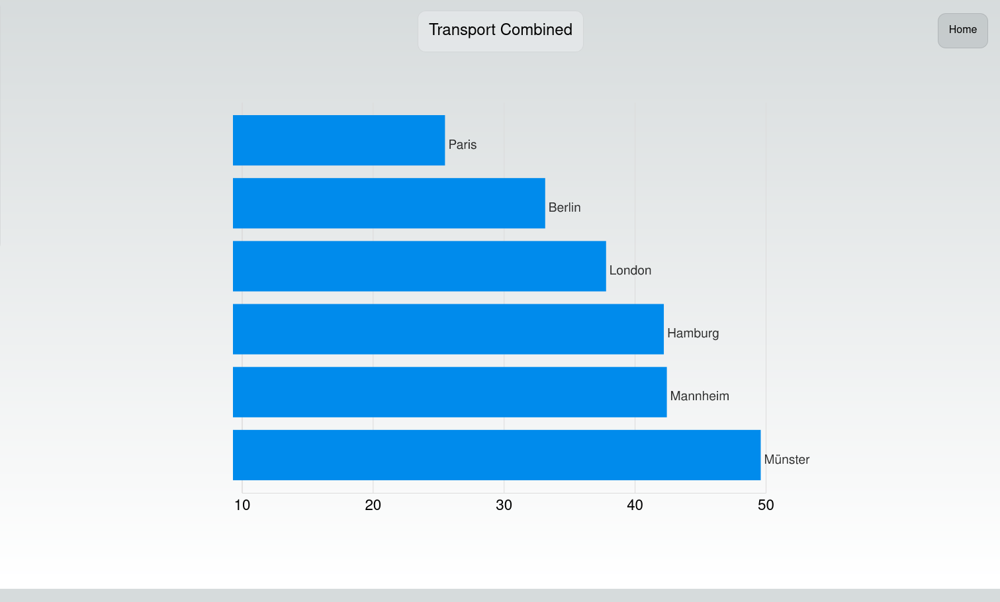
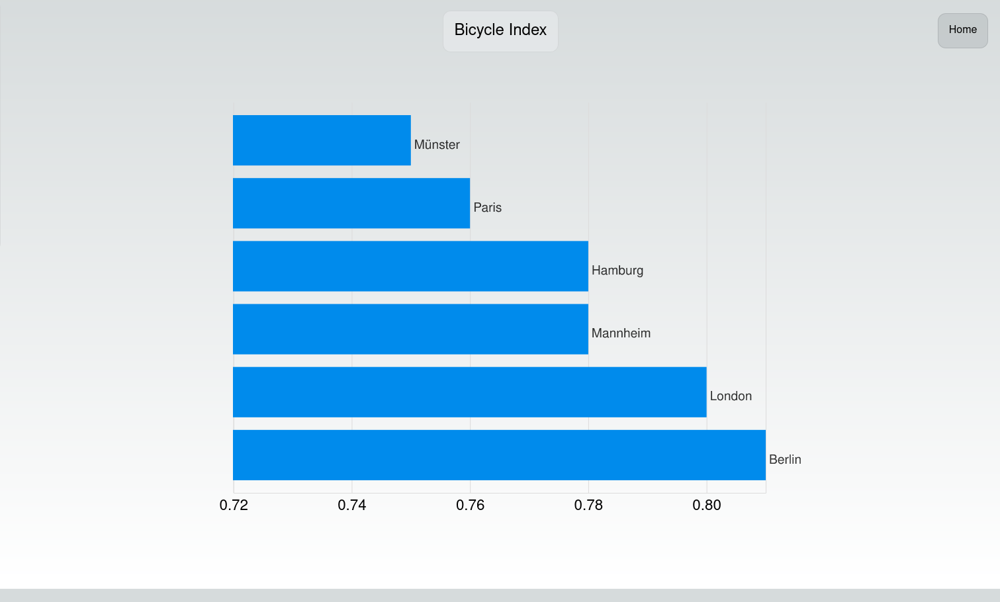
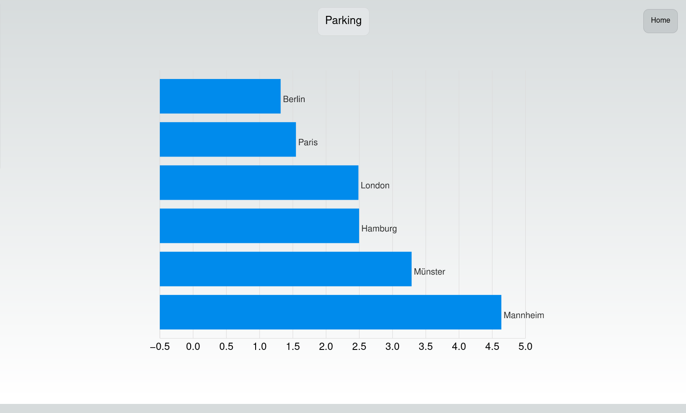
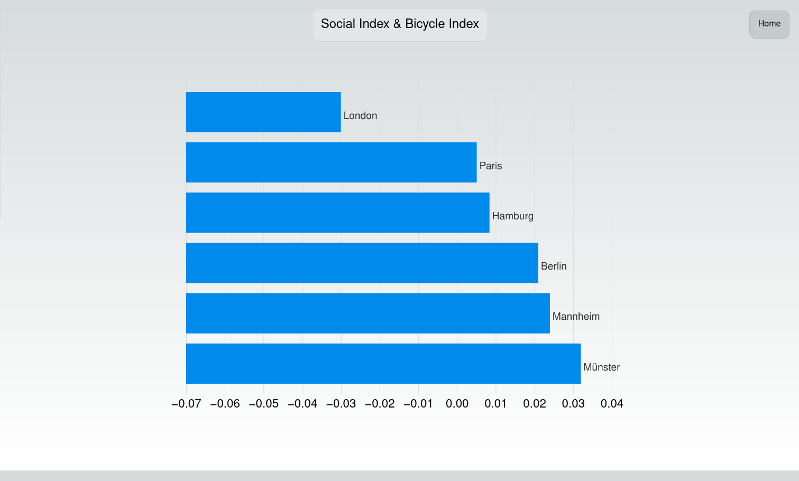
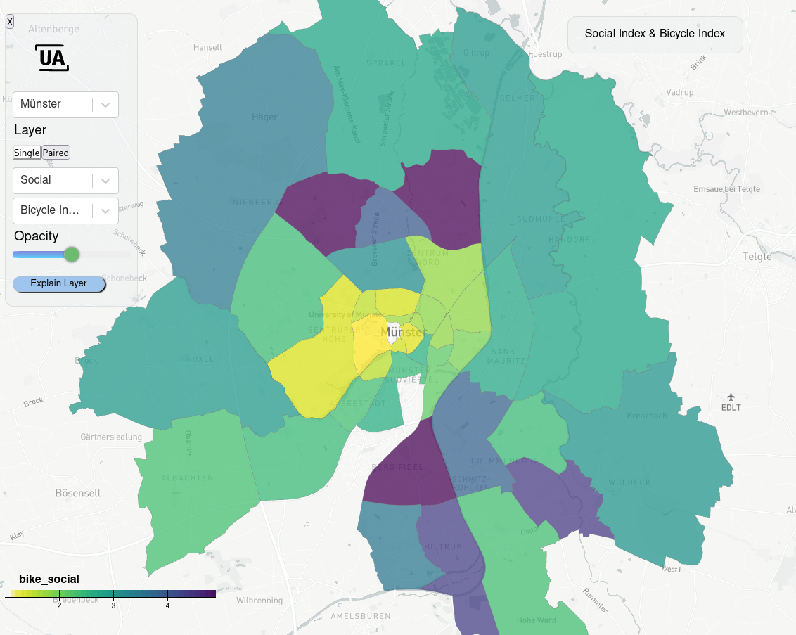

```{r xaringan, include = FALSE}
library(xaringanthemer)
source ("myxaringantheme.R")
```

```{r setup, include=FALSE}
options(htmltools.dir.version = FALSE)# suppress version num in subdir name

knitr::opts_chunk$set(cache = TRUE,
                      warning = FALSE)
                      #message = FALSE)
```

class: center, middle, inverse

`r icons::icon_style (icons::fontawesome ("globe"), size = 5, fill = "white")` urbananalyst.city

`r icons::icon_style (icons::fontawesome ("envelope"), scale = 1, fill = "white")` .small[mark.padgham@email.com]


---

class: center, top

# Urban Analyst

Mit finanziellen Unterstützung von:

 

In Zusammenarbeit mit:

```{r, out.width="17%", eval = TRUE, echo = FALSE}

```


---
class: left, top

# Was ist Urban Analyst?

### Eine Plattform mit:

- Interaktive Karten für jede Stadt mit voranalysierten Datensätzen

- Statistische Darstellungen für jeden Datensatz zum Vergleich jeder Stadt

- ... Weitere Funktionen in Entwicklung


---
class: left, top, inverse
background-image: url(img/ms-bike-map.png)
background-size: contain
background-position: 50% 50%

---
class: left, top, inverse
background-image: url(img/bike-stats-full.png)
background-size: contain
background-position: 50% 50%


---
class: left, top

# Was für Daten?

- Hauptsächlich mobilitäts- und verkehrsorientierte Datensätze, die in Bezug auf Reisezeiten und Entfernungen analysiert werden

--

### Beispiele

- Fahrtzeiten zwischen jedem Paar von Straßenkreuzungen mit allen möglichen Verkehrsmitteln

- Entfernungen zu den nächstgelegenen Bildungseinrichtungen

- Proportionale Entfernung aller möglichen Fahrten, die durch oder entlang von Naturräumen verlaufen


---
class: left, top

# Was für Daten?

- Alle Datensätze sind mit einem primären soziodemografischen Indikator sowie mit einander in Verbindung gestellt.

- Diese statistisch analysierten Beziehungen bieten z.B. einen direkten Einblick in die Beziehung zwischen:

  - der Nähe zu Bildungseinrichtungen und dem Zugang zu Naturräumen, oder
  - der Fahrradinfrastruktur und den soziodemografischen Bedingungen.

--

- Und ermöglichen den Vergleich dieser statistischen Beziehungen zwischen verschiedenen Städten

---
class: left, top

# Warum Urban Analyst?

- Macht statistische vergleiche zwischen Städten offen und transparent

- Ermöglicht es den Städten, direkt von anderen Städten zu lernen

- Transfer von Fachwissen aus geschlossenen, privaten (Beratungs-)Unternehmen zurück in öffentliche Hände


---
class: left, top

# And was nun?

- In der nächsten Phase wird ein Algorithmus für maschinelles Lernen entwickelt, der plausible Wege aufzeigt, wie eine Stadt einer anderen Stadt in Bezug auf die gewünschten Variablen und/oder die Beziehungen zwischen den Variablen gleichwertiger werden kann.

- Sie wird sich auf historische Analysen der Entwicklungsverläufe der letzten etwa fünf Jahre stützen, insbesondere um plausible Entwicklungsraten zu kalibrieren.

---
class: left, top

# Und was für die Stadt Münster

- *Masterplan Mobilität Münster 2035+* schlägt zahlreiche Maßnahmen vor. z.B.
    - S-bahn Netz
    - Metrobussystem
    - Parkplatzreduzierung

---
class: left, top

# Und was für die Stadt Münster



---
class: left, top

# Und was für die Stadt Münster



---
class: left, top

# Und was für die Stadt Münster



---
class: left, top

# Und was für die Stadt Münster



---
class: left, top



---
class: left, top

# Warum Urban Analyst?

- Es wird einen einheitlichen berblick über die kombinierten Auswirkungen aller vorgeschlagenen Maßnahmen geben

- Es wird quantitative Vergleiche der Auswirkungen dieser Maßnahmen mit anderen Städten ermöglichen

- In der nächsten Phase wird ein Vergleich der vorgeschlagenen Entwicklungsverläufe mit einer Reihe von plausiblen optimalen Verläufen ermöglichen
